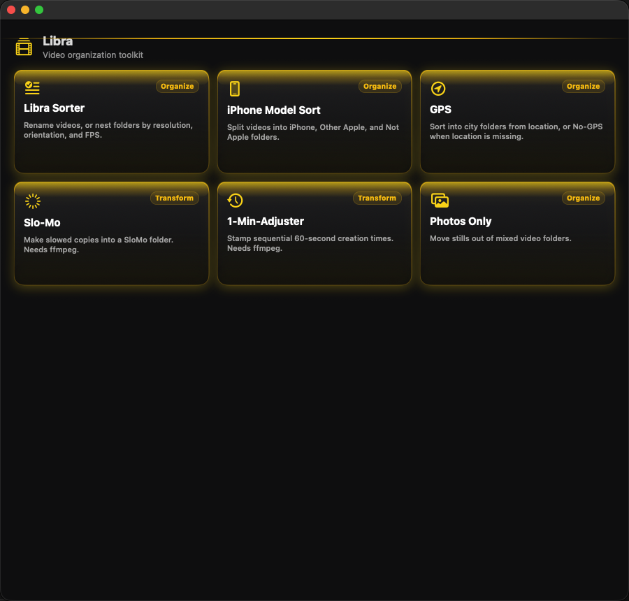

# Libra

[](https://github.com/RazorBackRoar/Libra/releases/latest)
[](https://github.com/RazorBackRoar/Libra/actions/workflows/ci.yml)
[](LICENSE)
[](https://swift.org/)
[](https://support.apple.com/en-us/HT211814)
[](https://developer.apple.com/documentation/mapkit)

**Local-first macOS video organization toolkit.**

Drag folders onto a tool, preview with Dry Run, and tidy libraries on your machine — sort, rename, slow-mo, 1-minute stamps, plus GPS / iPhone helpers with a built-in **City / GPS Map** (5-mile pins).

<p align="center">
  <a href="https://github.com/RazorBackRoar/Libra/releases/latest/download/Libra.dmg"><strong>↓ Download Libra.dmg</strong></a>
  ·
  <a href="https://github.com/RazorBackRoar/Libra/releases">All releases</a>
</p>



## Features

- **Drag-and-drop tools** — drop a folder to scan; Dry Run previews automatically
- **Undo last run** — put moved files back (or delete created copies)
- **Dry Run first** — bright yellow toggle; Desktop reports named `Libra Sorter Dry Run 1.txt` (tool name swaps per mode)
- **Home grid** — Libra Sorter, iPhone Model Sort, GPS, Slo-Mo, 1-Min-Adjuster, and Photos Only
- **Libra Sorter** — ProVid, VidRes, ProMax, MaxVid; optional prefix replaces the original name (`katie 720p W30 002.mp4`); KeepName keeps original filenames
- **City / GPS Map** — MapKit pins clustered within **5 miles**, merged by city; collapsed on sort tools, full on GPS Sorter; click a filename to open the video
- **GPS** — city folders from coordinates, `No-GPS` when missing
- **Optional date / camera folders** — extra sort keys on the sort tools
- **Duplicates** — likely extras (same size, duration, name) go in a Duplicates folder
- **iPhone Model Sort** — iPhone / Other Apple / Not Apple (videos)
- **Transform** — Slo-Mo copies and 1-Min-Adjuster sequential timestamps (these need ffmpeg)
- **Resilient import** — cancelable scans; per-file probe failures don’t stall the batch
- **Local-first organize** — sort, rename, and file moves stay on your Mac. City names on the GPS map use Apple reverse-geocode when you open the map (or run GPS Sorter). Check for Updates talks to GitHub when you ask.
- **Native SwiftUI** — Apple Silicon macOS app, ad-hoc signed DMG

## Install

1. Download [`Libra.dmg`](https://github.com/RazorBackRoar/Libra/releases/latest/download/Libra.dmg)
2. Open the DMG and drag **Libra.app** to `/Applications`
3. First launch — right-click → **Open** (ad-hoc signed build)

Requires macOS 14+ on Apple Silicon. ffmpeg / ffprobe via Homebrew when transforms need them.

## Usage

1. Open **Libra** and pick a tool from the home grid (use **Photos Only** to move stills out)
2. Drop a folder or video files, or use Open Folder / Select Files
3. Leave **Preview only** on to plan the run; turn it off and press **Write** to change files (confirm first)
4. Use **Undo last run** if a live pass wasn’t what you wanted
5. Use the City / GPS Map pins to inspect locations; click a filename to open the video
6. Click a row to open the file; right-click to Reveal in Finder

## Development

```bash
swift build
swift run
```

`swift test` requires the full Xcode.app (XCTest).

Package a macOS `.app` + DMG (ad-hoc signed):

```bash
./scripts/build-mac.sh
# → build/Release/Libra.dmg
```

| Surface | Value |
|---------|-------|
| Display name (UI, Dock, `.app`, DMG) | **Libra** |
| GitHub | [RazorBackRoar/Libra](https://github.com/RazorBackRoar/Libra) |
| appId | `com.razorbackroar.libra` |
| Version | `Sources/Libra/Resources/version.json` |

## Docs

- [BUILD_AND_RELEASE.md](BUILD_AND_RELEASE.md)
- [CONTRIBUTING.md](CONTRIBUTING.md)
- [SECURITY.md](SECURITY.md)
- [CODE_OF_CONDUCT.md](CODE_OF_CONDUCT.md)

## License

MIT — see [LICENSE](LICENSE).

If you need me, give me a holler.
